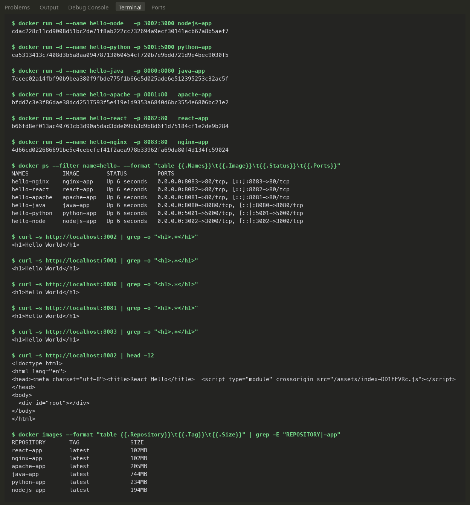
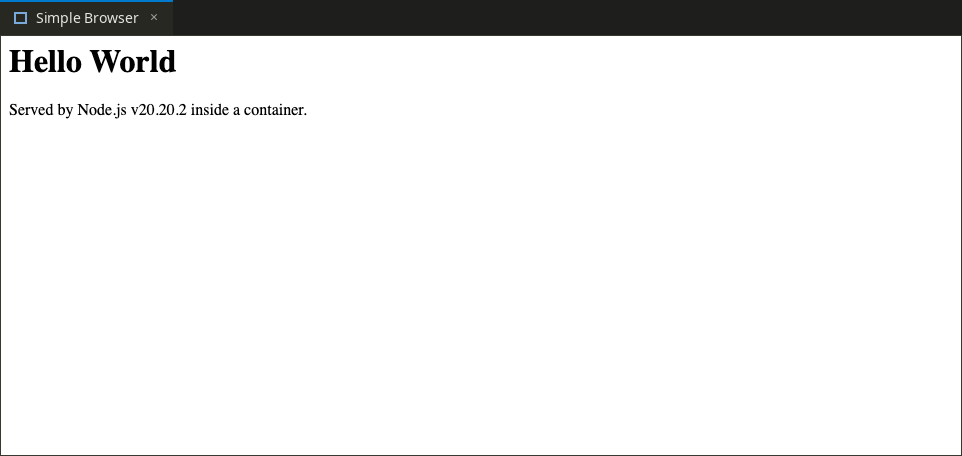
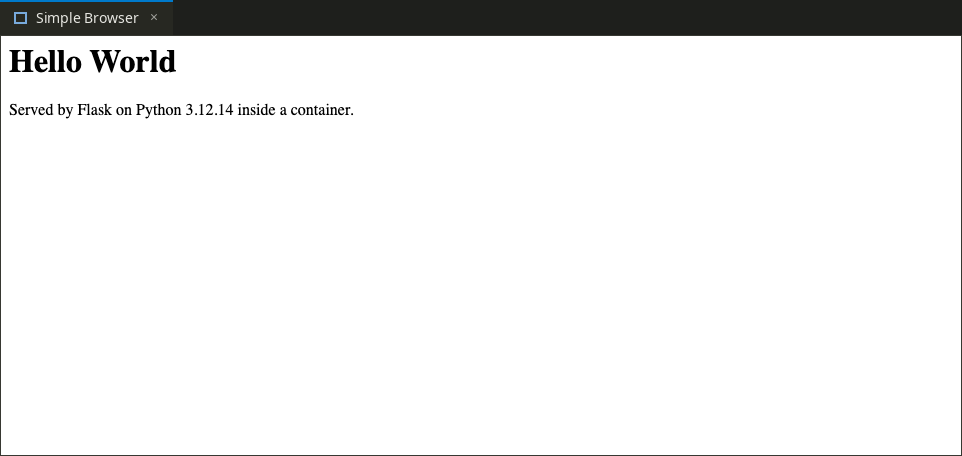
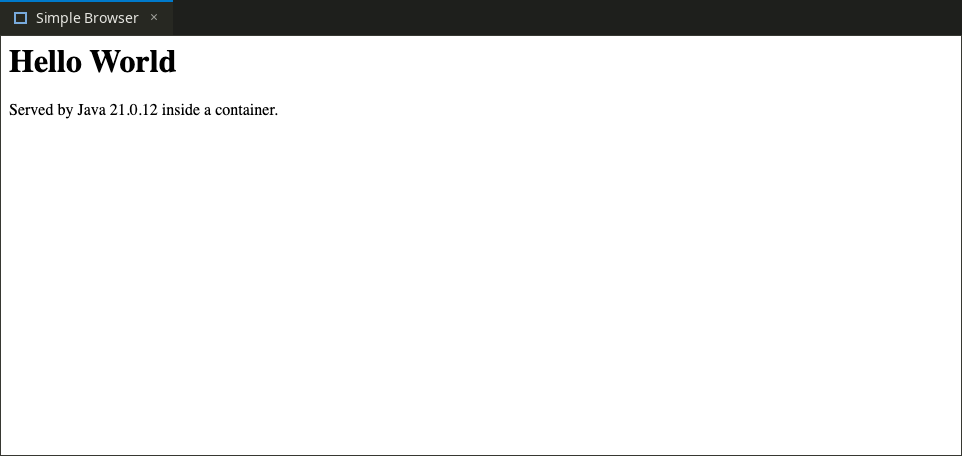
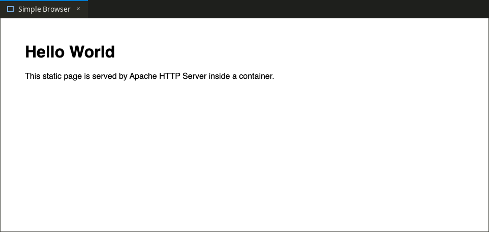
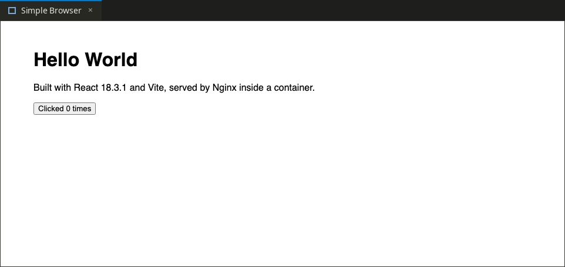
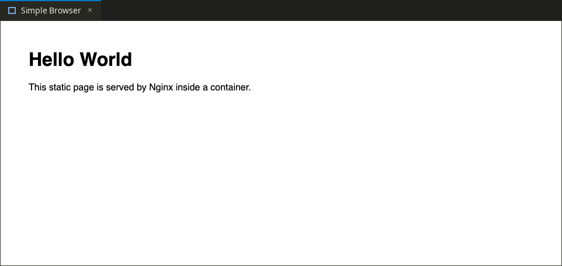

# Docker Fundamentals — Six "Hello World" Containers

Demonstrating container basics by packaging and serving the classic "Hello World" application across six different runtimes and web servers. Each application has its own dedicated directory and Dockerfile. All six containers were built and run simultaneously on the same host, with verified curl responses and browser screenshots.

---

## Directory & Runtime Overview

```
Docker Fundamentals/
├── nodejs-app/    Node.js 20 using the native core http module (zero npm dependencies)
├── python-app/    Python 3.12 running a lightweight Flask app
├── java-app/      Java 21 using the JDK's built-in HttpServer (compiled during build)
├── Apache-app/    Apache httpd 2.4 serving static HTML
├── React-app/     React 18 + Vite (multi-stage build: compiled with Node, served via Nginx)
└── nginx-app/     Nginx Alpine serving static HTML
```

---

## Port Allocation & Host Conflicts

Every container listens on its standard default port internally. On the host side, specific ports were chosen to avoid collisions with local services:
- **Port 5000** on macOS is grabbed by default by AirPlay Receiver, so Flask was routed to host port **5001**.
- **Ports 3000 & 3001** were occupied by local development tools, so Node.js was mapped to **3002**.

| Application | Image Name | Container Port | Mapped Host Port | Browser URL |
|---|---|---|---|---|
| **Node.js** | `nodejs-app` | 3000 | 3002 | `http://localhost:3002` |
| **Python / Flask** | `python-app` | 5000 | 5001 | `http://localhost:5001` |
| **Java** | `java-app` | 8080 | 8080 | `http://localhost:8080` |
| **Apache** | `apache-app` | 80 | 8081 | `http://localhost:8081` |
| **React** | `react-app` | 80 | 8082 | `http://localhost:8082` |
| **Nginx** | `nginx-app` | 80 | 8083 | `http://localhost:8083` |

---

## Building and Running the Containers

Build all six images locally from this directory:

```bash
docker build -t nodejs-app ./nodejs-app
docker build -t python-app ./python-app
docker build -t java-app   ./java-app
docker build -t apache-app ./Apache-app
docker build -t react-app  ./React-app
docker build -t nginx-app  ./nginx-app
```

Launch all containers in detached mode:

```bash
docker run -d --name hello-node   -p 3002:3000 nodejs-app
docker run -d --name hello-python -p 5001:5000 python-app
docker run -d --name hello-java   -p 8080:8080 java-app
docker run -d --name hello-apache -p 8081:80   apache-app
docker run -d --name hello-react  -p 8082:80   react-app
docker run -d --name hello-nginx  -p 8083:80   nginx-app

# Inspect running instances
docker ps --filter name=hello-
```

### Clean Teardown

Stop and remove all demo containers in one shot:

```bash
docker rm -f hello-node hello-python hello-java hello-apache hello-react hello-nginx
```

---

## Dockerfile Design Notes

- **`nodejs-app` (`node:20-alpine`):** Uses Node's built-in `http` package, avoiding `npm install` altogether. A `.dockerignore` file keeps local build artifacts and node_modules from polluting the build context.
- **`python-app` (`python:3.12-slim`):** Implements layer caching best practices by copying `requirements.txt` and running `pip install` *before* copying application code. This ensures dependencies stay cached when only `app.py` is edited. The server explicitly listens on `0.0.0.0` so traffic routed through Docker port-forwarding is accepted.
- **`java-app` (`eclipse-temurin:21-jdk`):** Compiles the source file (`javac Main.java`) during the image build step. By leveraging the JDK's built-in `com.sun.net.httpserver`, no external build tools like Maven or Gradle were required for this demo.
- **`Apache-app` (`httpd:2.4`):** Simple static serving by copying our custom `index.html` directly into `/usr/local/apache2/htdocs/`.
- **`React-app` (Multi-stage):** Stage 1 runs `node:20-alpine` to install packages and compile the production bundle with `vite build`. Stage 2 starts clean from `nginx:alpine` and copies only the resulting `dist/` directory. The entire Node.js runtime and build toolchain are discarded, keeping the final production image lean.
- **`nginx-app` (`nginx:alpine`):** Copies static HTML directly into `/usr/share/nginx/html/`.

---

## Final Image Sizes & Efficiency

| Image | Tag | Resulting Size |
|---|---|---|
| `nginx-app` | `latest` | 102 MB |
| `react-app` | `latest` | 102 MB |
| `nodejs-app` | `latest` | 194 MB |
| `apache-app` | `latest` | 205 MB |
| `python-app` | `latest` | 234 MB |
| `java-app` | `latest` | 744 MB |

*Why is Java so heavy?* The `java-app` carries a complete JDK (Java Development Kit) with full compiler tooling. Switching to a two-stage build that compiles in a JDK and runs in a stripped JRE (or custom `jlink` runtime) would drop this size dramatically—just like the React container did.

---

## Verification & Screenshots

### Terminal Verification (Build, Run, Curl & Inspect)

A terminal run verifying that all six containers successfully booted and curl returned clean responses:



### Browser Verification

Verifying each service in a real browser session:

| | |
|---|---|
| **Node.js** (`:3002`)<br> | **Python / Flask** (`:5001`)<br> |
| **Java** (`:8080`)<br> | **Apache** (`:8081`)<br> |
| **React + Vite** (`:8082`)<br> | **Nginx** (`:8083`)<br> |
