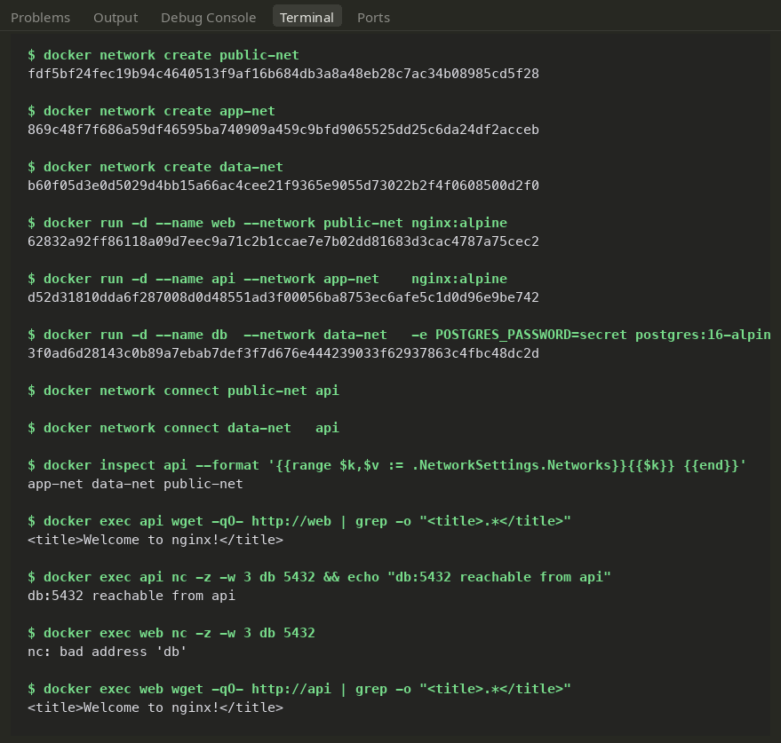
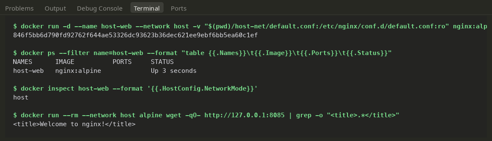
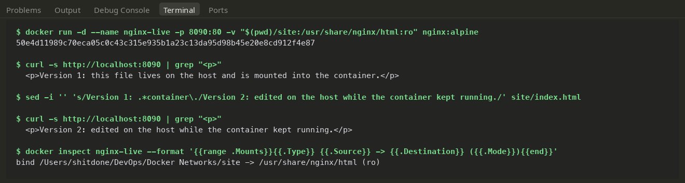
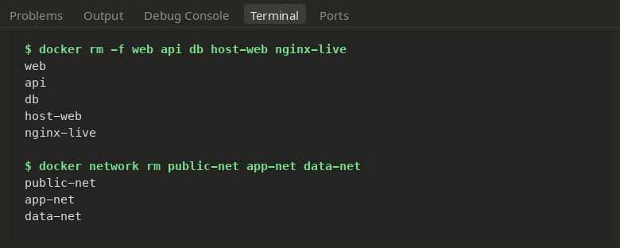

# Docker Networks & Volumes — Lab Notes

Hands-on exploration of Docker networking primitives and volume mounting: setting up isolated user-defined bridge networks across a 3-tier architecture, utilizing host networking mode, syncing files live with bind mounts, and reviewing overlay networks for multi-host deployments.

---

## 1. Multi-Network Isolation (Three-Tier Topology)

The objective is to enforce strict network separation: the middle tier (`api`) needs to communicate with both the frontend (`web`) and database (`db`), but `web` must have zero direct visibility into `db`.

| Container | Base Image | Attached Networks |
|---|---|---|
| **`web`** | `nginx:alpine` | `public-net` |
| **`api`** | `nginx:alpine` | `app-net`, `public-net`, `data-net` |
| **`db`** | `postgres:16-alpine` | `data-net` |

### Setting Up Networks and Launching Containers

```bash
# Create three custom bridge networks
docker network create public-net
docker network create app-net
docker network create data-net

# Spin up containers
docker run -d --name web --network public-net nginx:alpine
docker run -d --name api --network app-net    nginx:alpine
docker run -d --name db  --network data-net   -e POSTGRES_PASSWORD=secret postgres:16-alpine

# Multi-home the api container by attaching it to both public and data networks
docker network connect public-net api
docker network connect data-net   api

# Confirm attached networks on the api container
docker inspect api --format '{{range $k,$v := .NetworkSettings.Networks}}{{$k}} {{end}}'
# Returns: app-net data-net public-net
```

### Verifying Network Boundaries

Testing inter-container connectivity using built-in utilities (`wget` and `nc`):

```bash
# api -> web: Allowed (shares public-net)
docker exec api wget -qO- http://web | grep -o "<title>.*</title>"

# api -> db: Allowed (shares data-net)
docker exec api nc -z -w 3 db 5432 && echo "db:5432 reachable from api"

# web -> db: BLOCKED (shares no common network)
docker exec web nc -z -w 3 db 5432
# Result: nc: bad address 'db' (DNS resolution fails completely)

# web -> api: Allowed (shares public-net)
docker exec web wget -qO- http://api | grep -o "<title>.*</title>"
```

### Key Takeaways:
- **Embedded DNS Resolution:** Containers connected to custom user-defined bridges automatically resolve sibling containers by name via Docker's embedded DNS server.
- **True Network Isolation:** Because `web` does not share `data-net` with `db`, it cannot even resolve the name `db`, let alone reach its port. This gives much stronger isolation than relying on software firewalls alone.
- **Multi-Homed Services:** A container can belong to multiple networks simultaneously, obtaining a unique virtual interface and IP on each one.



---

## 2. Host Networking Mode (`--network host`)

When using `--network host`, Docker disables network namespace isolation for the container; the container binds directly to the host's network interfaces.

To avoid port conflicts on port 80, Nginx was configured via a mounted config (`host-net/default.conf`) to listen on port `8085`:

```nginx
server {
    listen 8085;
    location / {
        root  /usr/share/nginx/html;
        index index.html;
    }
}
```

### Starting the Container on the Host Network

```bash
docker run -d --name host-web --network host \
  -v "$(pwd)/host-net/default.conf:/etc/nginx/conf.d/default.conf:ro" nginx:alpine

# Notice the PORTS column is completely empty (no NAT / port translation)
docker ps --filter name=host-web
docker inspect host-web --format '{{.HostConfig.NetworkMode}}'   # Output: host
```

*(On Docker Desktop for macOS, the engine runs inside a lightweight Linux VM. To test reachability on that VM's host network, an Alpine test container made an internal request to `127.0.0.1:8085`)*:

```bash
docker run --rm --network host alpine wget -qO- http://127.0.0.1:8085 | grep -o "<title>.*</title>"
# Returns: <title>Welcome to nginx!</title>
```

On a standard Linux machine, this service is immediately reachable right from `http://localhost:8085`.



---

## 3. Live File Updates with Bind Mounts

A bind mount directly mounts a specific directory from the host filesystem into a container directory. Any file edit made on either side is reflected immediately because both point to the exact same filesystem location.

```bash
mkdir site
# Initialize site/index.html

# Run Nginx with site mounted read-only (:ro)
docker run -d --name nginx-live -p 8090:80 \
  -v "$(pwd)/site:/usr/share/nginx/html:ro" nginx:alpine

# Test initial file content
curl -s http://localhost:8090 | grep "<p>"
# Output: <p>Version 1: this file lives on the host and is mounted into the container.</p>

# Update file directly on the host while the container is actively running
sed -i '' 's/Version 1: .*container\./Version 2: edited on the host while the container kept running./' site/index.html

# Verify the immediate change without rebuilding or restarting
curl -s http://localhost:8090 | grep "<p>"
# Output: <p>Version 2: edited on the host while the container kept running.</p>

# Inspect mount properties
docker inspect nginx-live --format '{{range .Mounts}}{{.Type}} {{.Source}} -> {{.Destination}} ({{.Mode}}){{end}}'
```

**Takeaway:** Bind mounts eliminate the need to rebuild images during local development. The `:ro` flag ensures the container cannot tamper with or overwrite local host files.



---

## 4. Overlay Networks (Multi-Host Overview)

Standard Docker bridge networks are confined to a single host machine. An **overlay network** bridges multiple Docker daemon hosts across a cluster so containers on separate physical or virtual machines can communicate securely by name as if they were plugged into the same local switch.

### Architecture Highlights:
- **VXLAN Encapsulation:** Traffic between containers across different nodes is encapsulated into standard UDP packets (port `4789`), transmitted across the physical network, and decapsulated at the destination node.
- **Cluster Coordination:** Multi-host node membership and IP state are managed via orchestrators like **Docker Swarm** (or via CNI plugins such as Calico / Cilium / Flannel in Kubernetes).
- **In-Flight Encryption:** Can be activated seamlessly with `--opt encrypted` during network creation.

### Swarm Minimal Setup Example:

```bash
docker swarm init
docker network create --driver overlay --attachable team-overlay
docker service create --name web --network team-overlay --replicas 3 nginx:alpine
```

### Bridge vs. Overlay Comparison

| Feature | Bridge Network | Overlay Network |
|---|---|---|
| **Scope** | Single Docker host | Distributed across multiple cluster hosts |
| **Requires Orchestrator?** | No | Yes (Docker Swarm or Kubernetes) |
| **Encapsulation** | None (standard Linux bridge) | VXLAN tunneling over UDP |
| **Primary Use Case** | Local testing & single-host services | Multi-node clusters & distributed microservices |

---

## Clean Up Lab Resources

```bash
docker rm -f web api db host-web nginx-live
docker network rm public-net app-net data-net
```


