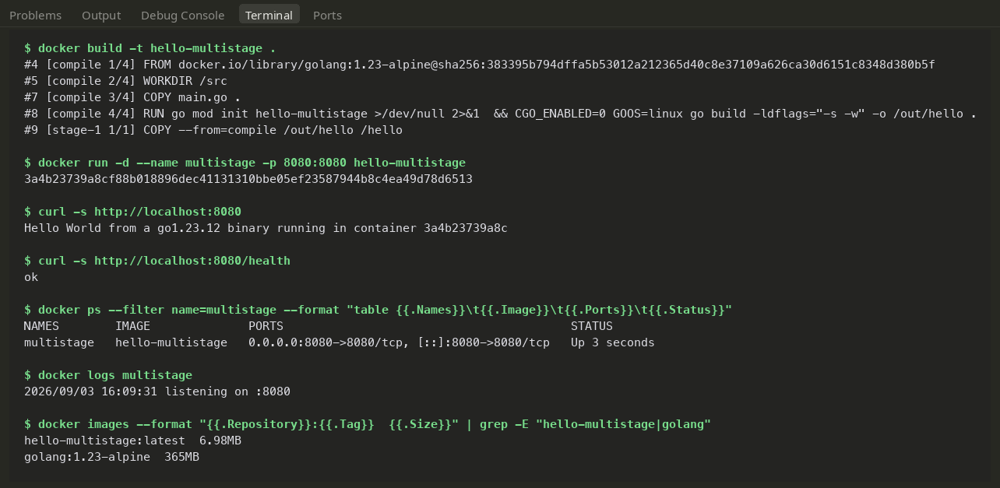
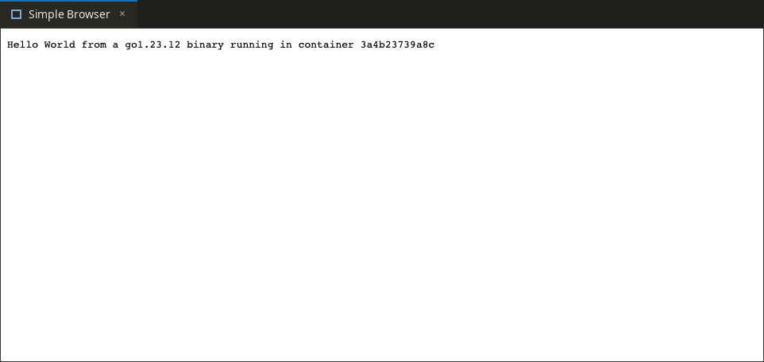

# Dockerfiles & Images — Multi-Stage Go Build

Walkthrough of creating a production-ready container image with Docker multi-stage builds. We build a Go web service and strip away the entire compiler toolchain, shrinking a ~365 MB build environment into a ~7 MB standalone binary image running on `scratch`.

---

## Why Multi-Stage Builds Matter

When shipping compiled languages (like Go, Rust, or C++), you need compilers, headers, and package tools to *build* the binary, but none of that stuff is needed to actually *run* it.

A standard single-stage Dockerfile leaves the compiler and intermediate build cache inside the final image, bloating its footprint and expanding the security attack surface. A **multi-stage build** solves this by using one `FROM` image for compilation and a second, minimal `FROM` image for execution—copying only the compiled binary across via `COPY --from=<stage>`.

---

## The Go Application (`main.go`)

A minimal HTTP server listening on port `8080`.
- `/`: Greets with the Go runtime version and the container's hostname.
- `/health`: Simple health check endpoint returning `ok`.

```go
package main

import (
	"fmt"
	"log"
	"net/http"
	"os"
	"runtime"
)

func main() {
	host, _ := os.Hostname()

	http.HandleFunc("/", func(w http.ResponseWriter, r *http.Request) {
		fmt.Fprintf(w, "Hello World from a %s binary running in container %s\n", runtime.Version(), host)
	})
	http.HandleFunc("/health", func(w http.ResponseWriter, r *http.Request) {
		w.WriteHeader(http.StatusOK)
		fmt.Fprintln(w, "ok")
	})

	log.Println("listening on :8080")
	log.Fatal(http.ListenAndServe(":8080", nil))
}
```

---

## The Multi-Stage Dockerfile

```dockerfile
# Stage 1: Build & compile. The heavy Go SDK stays trapped here.
FROM golang:1.23-alpine AS compile
WORKDIR /src
COPY main.go .
RUN go mod init hello-multistage >/dev/null 2>&1 \
 && CGO_ENABLED=0 GOOS=linux go build -ldflags="-s -w" -o /out/hello .

# Stage 2: Minimal runtime. Zero package manager, zero shell.
FROM scratch
COPY --from=compile /out/hello /hello
EXPOSE 8080
ENTRYPOINT ["/hello"]
```

### Key Technical Flags:

- **`CGO_ENABLED=0`**: Disables cgo to produce a purely static Linux binary with no dynamic libc dependencies. This allows it to run smoothly on `scratch` (Docker's empty base image).
- **`-ldflags="-s -w"`**: Strips debugging information and the symbol table from the binary, cutting its size nearly in half.
- **`AS compile`**: Names the builder stage so subsequent stages can copy files from it cleanly using `--from=compile`.
- **JSON Exec Form `["/hello"]`**: Because `scratch` contains no `/bin/sh` or `/bin/bash`, `ENTRYPOINT` must use the exec array format to run the executable directly.

---

## Build, Run, and Validation

```bash
# Build the image
docker build -t hello-multistage .

# Run container in the background
docker run -d --name multistage -p 8080:8080 hello-multistage

# Test endpoints
curl http://localhost:8080
# Output: Hello World from a go1.23.12 binary running in container 3a4b23739a8c

curl http://localhost:8080/health
# Output: ok

# Check container state and logs
docker ps --filter name=multistage
docker logs multistage
```

`docker ps` confirms the container mapped `0.0.0.0:8080->8080/tcp`, and the logs verified `listening on :8080`.

---

## Size Optimization Result

| Stage / Image | Size | Description |
|---|---|---|
| `golang:1.23-alpine` | ~365 MB | Builder environment carrying compiler, toolchains, and packages |
| `hello-multistage` | **6.98 MB** | Final runtime container with just the single binary on `scratch` |

The final container is roughly **2%** the size of the build image—dramatically faster to pull, deploy, and restart.

---

## Screenshots from the Run

### Terminal Build, Run, Logs & Size Check



### Browser Confirmation

Checking port 8080 in a local browser:



---

## Three Different Application Types

As required for the coursework, three distinct application types across different runtimes are implemented in the [`Docker Fundamentals/`](../Docker%20Fundamentals/) directory:

| Language / Runtime | Path | Base Image | Port | Screenshot Reference |
|---|---|---|---|---|
| **Node.js** | [`Docker Fundamentals/nodejs-app`](../Docker%20Fundamentals/nodejs-app/) | `node:20-alpine` | 3000 | `Docker Fundamentals/screenshots/nodejs.png` |
| **Python** | [`Docker Fundamentals/python-app`](../Docker%20Fundamentals/python-app/) | `python:3.12-slim` | 5000 | `Docker Fundamentals/screenshots/python.png` |
| **Java** | [`Docker Fundamentals/java-app`](../Docker%20Fundamentals/java-app/) | `eclipse-temurin:21-jdk` | 8080 | `Docker Fundamentals/screenshots/java.png` |

Each was built with `docker build -t <name> .` and executed with port mappings; comprehensive verification logs and browser captures are provided in that directory.
