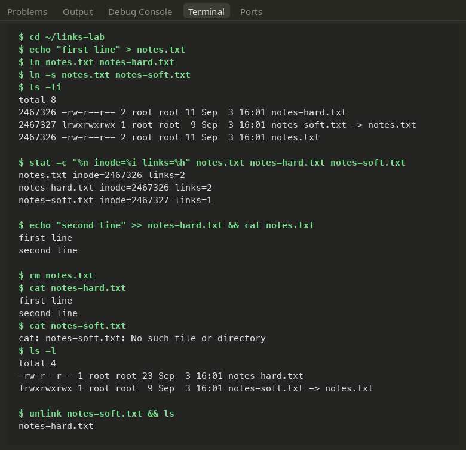
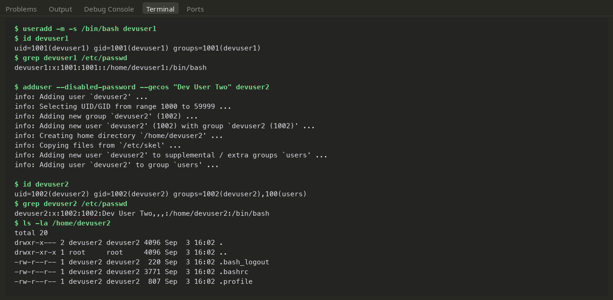
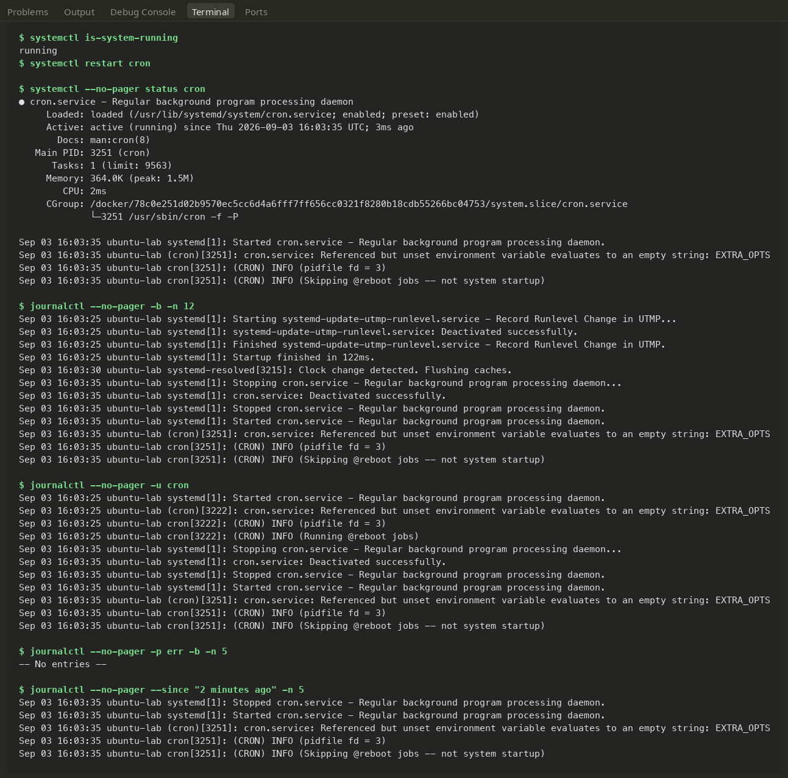
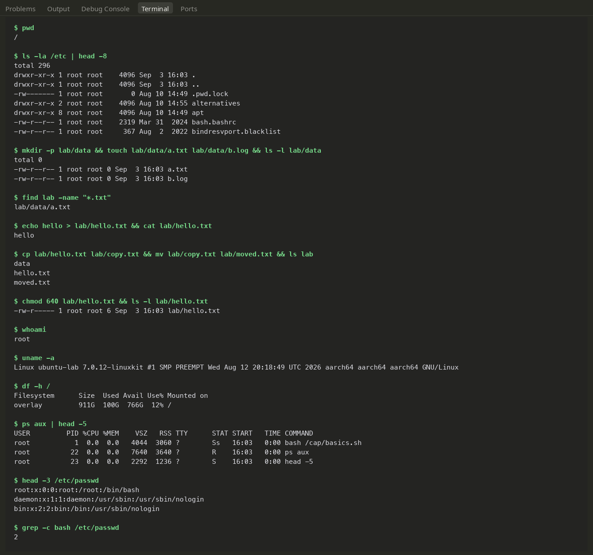

# Linux Fundamentals — Lab Notes & Experiments

Practical notes taken during the Linux hands-on session. Everything here was executed directly in an Ubuntu 24.04 environment (container hostname `ubuntu-lab`), with verified terminal commands and attached screenshots.

---

## Part 1: Hard Links vs Symbolic (Soft) Links

Under the hood in Linux, a filename is just a human-friendly label pointing to an **inode** (the data structure holding file metadata and physical block locations). Creating links gives us two different ways to refer to that underlying data:

- **Hard Link**: Another directory entry pointing directly to the exact same inode. There's no master or original copy—all hard links are equal peers. The inode's reference counter goes up by 1. Data remains safe on disk until *every* hard link is deleted (count drops to zero).
- **Symbolic Link (Symlink)**: A small, standalone pointer file containing a path string to the target file. It gets its own distinct inode. If the target gets deleted, the symlink breaks ("dangling link").

### Comparison Summary

| Feature | Hard Link | Symbolic Link |
|---|---|---|
| **What it points to** | Direct Inode number | Path string to the target |
| **Separate Inode?** | No (shares target's inode) | Yes (unique inode created) |
| **If target file is deleted** | Stays completely valid & readable | Becomes a broken/dangling link |
| **Cross-filesystem support** | No (inodes are filesystem-bound) | Yes |
| **Can link directories** | No (restricted to prevent loops) | Yes |
| **Listing marker (`ls -l`)** | Looks like a standard file | Starts with `l`, displays `-> target` |

### Commands Run

```bash
ln notes.txt notes-hard.txt        # Creates a hard link
ln -s notes.txt notes-soft.txt     # Creates a symbolic link
ls -li                             # -i shows the inode numbers
stat -c "%n inode=%i links=%h" notes.txt notes-hard.txt notes-soft.txt
rm notes.txt                       # Delete the first filename
unlink notes-soft.txt              # Remove the symlink (works like rm)
```

### Observations from the Run

- `notes.txt` and `notes-hard.txt` showed the exact same inode (`2467326`) and a link count of `2`.
- `notes-soft.txt` had its own separate inode and a link count of `1`.
- Appending new lines through `notes-hard.txt` updated `notes.txt` instantly, proving they share identical data blocks.
- Once `notes.txt` was removed with `rm`, `notes-hard.txt` still displayed the complete file contents without issue. In contrast, opening `notes-soft.txt` immediately failed with `No such file or directory`.



---

## Part 2: `useradd` vs `adduser`

Both commands add user accounts on Linux, but operate at completely different abstraction layers.

- **`useradd`**: The low-level standard system utility (part of `shadow-utils`). It does strictly what you flag and nothing more. Without `-m`, it won't create a home directory. Without `-s`, it assigns the system fallback shell (`/bin/sh`), and leaves the account locked without a password.
- **`adduser`**: A higher-level interactive Perl wrapper provided on Debian/Ubuntu systems. It delegates to `useradd` behind the scenes, but automatically picks the next available UID, creates `/home/<user>`, copies over shell templates from `/etc/skel`, assigns `/bin/bash`, adds the user to the `users` group, and prompts for passwords and info.

**Rule of thumb:** Use `adduser` when manually setting up a user at the terminal for a quick, fully configured account. Use `useradd` in automation scripts, CI/CD pipelines, and Dockerfiles where interactive prompts would break execution and explicit flags are preferred.

### Commands Run

```bash
# Low-level user creation (script-friendly)
useradd -m -s /bin/bash devuser1
id devuser1
grep devuser1 /etc/passwd

# High-level user creation (with automated flags to bypass prompts)
adduser --disabled-password --gecos "Dev User Two" devuser2
id devuser2
grep devuser2 /etc/passwd
ls -la /home/devuser2
```

*(Flags `--disabled-password` and `--gecos` allowed `adduser` to complete without waiting for interactive input).*

### Observations from the Run

- `useradd` created `devuser1` with minimal defaults: assigned UID 1001, single primary group, and an empty home directory.
- `adduser` stepped through a complete setup: allocated UID 1002, initialized the home folder, copied skeleton config files (`.bashrc`, `.profile`, `.bash_logout`), and logged full user details (`Dev User Two,,,`) inside `/etc/passwd`.
- *Note:* The minimal `ubuntu:24.04` base Docker image doesn't include `adduser` out of the box, so running `apt-get install adduser` was necessary first.



---

## Part 3: Service Logging with `journalctl`

`journalctl` is the query interface for `systemd-journald`. Instead of manually finding and grepping through separate files in `/var/log/`, you filter structured system logs by service unit, severity, boot session, or timeframe.

### Everyday Log Queries

```bash
journalctl                      # Paginated view of all logs (oldest first)
journalctl -b                   # Logs restricted to current boot
journalctl -n 20                # Tail the last 20 log entries
journalctl -f                   # Real-time streaming follow mode (like tail -f)
journalctl -u cron              # Filter logs specifically for 'cron' service
journalctl -p err               # Filter by priority: errors and worse
journalctl --since "2 minutes ago" # Time-bounded query
journalctl --since today --until "1 hour ago"
journalctl --no-pager           # Raw dump without pager, perfect for pipes/scripts
```

### Hands-on Test: Inspecting the `cron` Service

Because plain Docker containers run without standard init systems, testing `systemd-journald` required booting `ubuntu:24.04` with systemd enabled and PID 1 set to `/usr/lib/systemd/systemd` (using `--privileged` and host cgroup namespaces). Once the environment hit `running` status:

```bash
systemctl restart cron
systemctl --no-pager status cron
journalctl --no-pager -b -n 12
journalctl --no-pager -u cron
journalctl --no-pager -p err -b -n 5
journalctl --no-pager --since "2 minutes ago" -n 5
```

The output cleanly highlighted cron stopping and restarting, confirmed no errors (`-- No entries --` with `-p err`), and returned only recent events when filtered by time.



---

## Part 4: Practical Command Cheatsheet

A handy, task-oriented cheatsheet for daily terminal use.

### File & Directory Navigation
| Command | What it's for |
|---|---|
| `pwd` | Show current directory path |
| `ls -la` | Detailed directory listing, including hidden files |
| `cd -` | Jump directly back to previous directory |
| `tree -L 2` | Display folder hierarchy up to 2 levels deep |
| `find . -name "*.txt"` | Locate files by name pattern (`-type f`, `-mtime -1`) |
| `du -sh *` | Check human-readable disk consumption per item |

### File Manipulation
| Command | What it's for |
|---|---|
| `mkdir -p path/to/dir` | Recursively create parent and child directories |
| `touch file.txt` | Create an empty file or update file timestamps |
| `cp -r src/ dst/` | Copy files or whole directory trees recursively |
| `mv old.txt new.txt` | Move or rename files and directories |
| `rm -rf dir/` | Force recursive deletion without prompting (use caution) |

### Viewing & Searching Content
| Command | What it's for |
|---|---|
| `cat file` | Print entire file contents to stdout |
| `less file` | Scrollable file viewer (`/` to search, `q` to exit) |
| `head -n 10` / `tail -n 10` | Output the first or last 10 lines |
| `tail -f app.log` | Stream file changes live as new lines get written |
| `grep -rn "needle" .` | Recursively search for text with matching line numbers |
| `wc -l file` | Count total lines in a file |

### File Permissions & Access
| Command | What it's for |
|---|---|
| `chmod 640 file` | Set permissions: owner rw-, group r--, world --- |
| `chmod +x script.sh` | Grant executable permissions |
| `chown user:group file` | Reassign file owner and group |
| `umask` | Check or set default permission mask for newly created files |

### User Management & Identity
| Command | What it's for |
|---|---|
| `whoami` / `id` | Current logged-in user, UID, and group IDs |
| `sudo adduser name` | Interactively set up a new user |
| `passwd name` | Set or update a user's password |
| `su - name` | Switch to user account with a fresh login shell |
| `groups name` | Show group memberships for a user |

### Process Monitoring & System Health
| Command | What it's for |
|---|---|
| `ps aux` | Snapshot of all running processes |
| `top` / `htop` | Interactive live view of CPU, memory, and tasks |
| `kill -15 PID` / `kill -9 PID` | Gracefully terminate (SIGTERM) or force-kill (SIGKILL) |
| `df -h` | Free and used disk space across mounted filesystems |
| `free -h` | Available physical memory and swap stats |
| `uname -a` | Print kernel release and system architecture |
| `uptime` | System running time and 1, 5, 15-minute load averages |

### Networking Basics
| Command | What it's for |
|---|---|
| `ip a` / `ip route` | Inspect IP addresses and kernel routing tables |
| `ss -tulpn` | Show open listening ports and associated processes |
| `ping -c 4 host` | Verify end-to-end host reachability and latency |
| `curl -I url` | Fetch and print HTTP response headers only |

### Services & Archives
| Command | What it's for |
|---|---|
| `systemctl status <svc>` | Check if a systemd service is active/running |
| `systemctl restart <svc>` | Restart a service daemon |
| `systemctl enable --now <svc>`| Enable service to start on boot and start it immediately |
| `journalctl -u <svc> -f` | Tail live logs for a specific service unit |
| `tar -czf archive.tar.gz dir/` | Compress a folder into a gzip tar archive |
| `tar -xzf archive.tar.gz` | Extract a compressed gzip tarball |
| `history \| grep <cmd>` | Search shell command history |

Terminal run demonstrating file permissions, ownership adjustments, and process checks:


