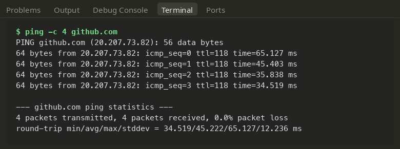
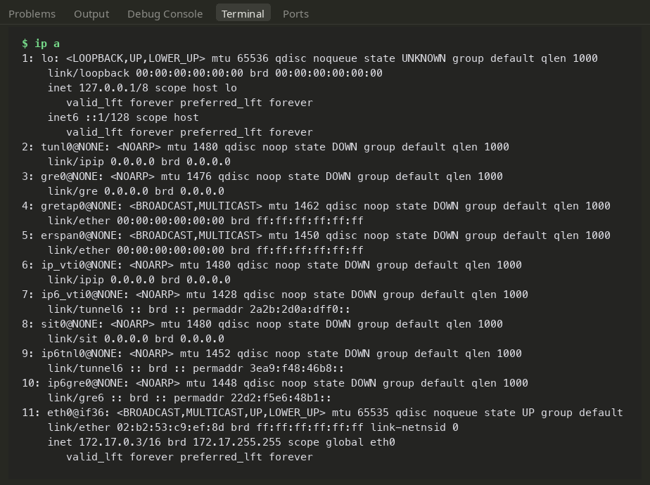
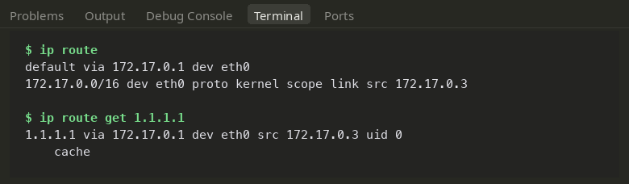
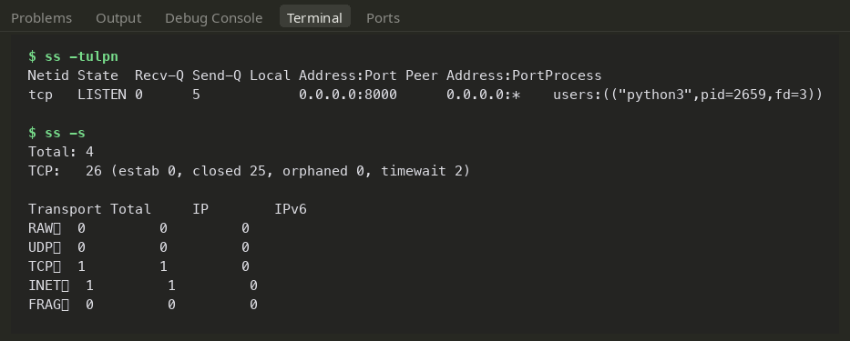
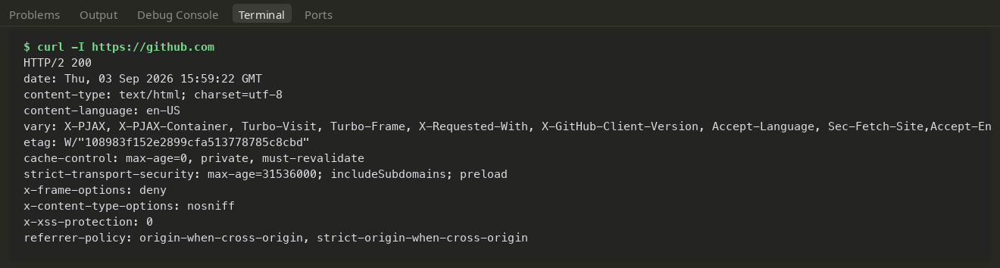
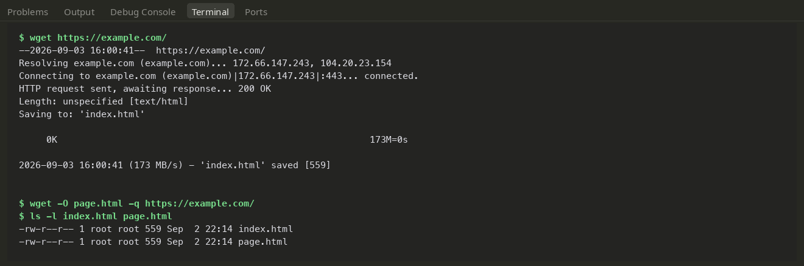
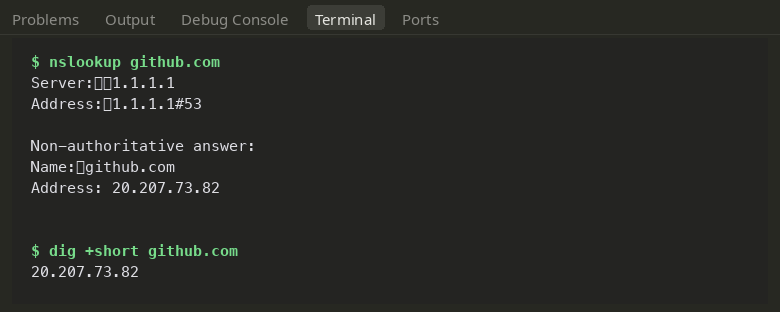
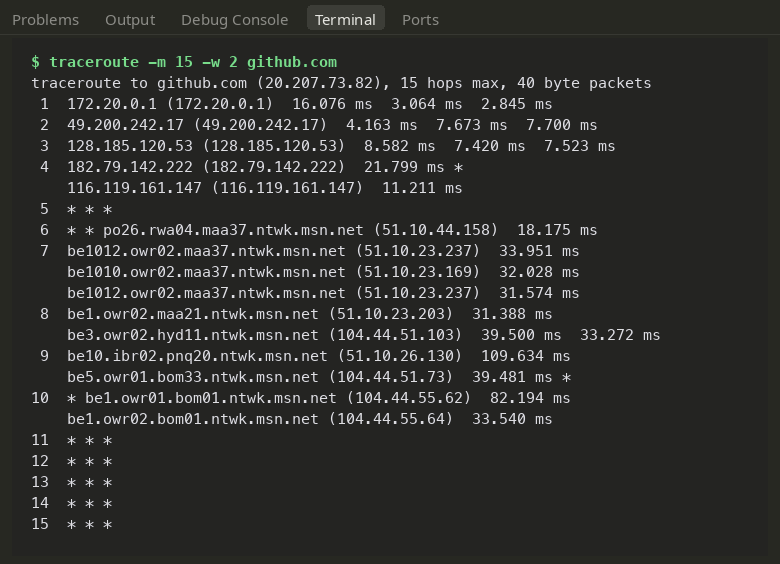
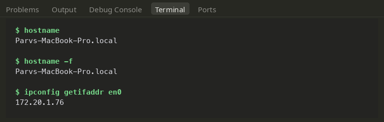

# Networking Fundamentals — Everyday Diagnostic Tools

Nine essential terminal networking utilities, tested hands-on with practical notes on interpreting their output. Commands standard across UNIX systems were run locally; Linux-specific tools (`ip`, `ss`, `wget`) were executed inside an Ubuntu 24.04 container.

---

## 1. `ping` — Host Reachability & Latency Check

```bash
ping -c 4 github.com
```

Sends 4 ICMP ECHO_REQUEST packets to the destination and listens for replies. The terminal first prints the resolved IP (`20.207.73.82`), followed by individual round-trip timings per packet. The summary block highlights packet loss (0%) and min/avg/max/stddev latency numbers.

**Real-world takeaway:** The quickest sanity check for basic IP connectivity. Keep in mind that some corporate firewalls and cloud hosts drop ICMP entirely, so a lack of ping responses doesn't always guarantee the server is offline.



---

## 2. `ip a` — Inspecting Network Interfaces & Addresses

```bash
ip a
```

Lists all physical and virtual interfaces alongside their operational state, MAC address, and configured IPv4/IPv6 subnets. In the container environment, the key interfaces are:
- `lo`: Loopback interface (`127.0.0.1`)
- `eth0`: Virtual container interface (`172.17.0.3/16`, attached to the default Docker bridge)

The `/16` CIDR notation defines the subnet mask. Inactive tunnel interfaces (`tunl0`, `gre0`, `sit0`) appear in `DOWN` state and can be safely ignored.

**Real-world takeaway:** The modern Linux standard replacing legacy `ifconfig`. You can also run `ip -br a` for a cleaner, one-line-per-interface summary.



---

## 3. `ip route` — Inspecting the Kernel Routing Table

```bash
ip route
ip route get 1.1.1.1
```

`ip route` reveals where outbound packets are dispatched:
- `default via 172.17.0.1`: Default gateway for any traffic heading outside the local network.
- `172.17.0.0/16 dev eth0`: Direct local subnet route.

`ip route get <destination>` tests the routing engine for a specific destination IP and prints the exact interface, gateway, and source IP that will handle the traffic.

**Real-world takeaway:** Essential when traffic leaves a machine but never reaches external servers; if the default gateway is absent or misconfigured, external traffic will simply fail.



---

## 4. `ss` — Active Ports and Sockets

```bash
# Start a quick background server to test against
python3 -m http.server 8000 &

# Inspect open sockets
ss -tulpn
ss -s
```

`ss -tulpn` lists listening TCP/UDP sockets with process ownership:
- `-t`: TCP sockets
- `-u`: UDP sockets
- `-l`: Listening sockets only
- `-p`: Show process name and PID
- `-n`: Show numerical port numbers instead of service names

The test server was captured listening on `0.0.0.0:8000` under process `python3`. `ss -s` provides total socket statistics across established, closed, and listening states.

**Real-world takeaway:** The modern replacement for `netstat`. Always the first tool to run when troubleshooting `"Address already in use"` errors during application startup.



---

## 5. `curl` — Direct HTTP / API Communication

```bash
curl -I https://github.com
```

The `-I` flag sends an HTTP `HEAD` request to inspect response headers without downloading the body. The session confirmed an `HTTP/2 200` status, cache headers, cookie flags, and security headers like `strict-transport-security`.

**Real-world takeaway:** The core CLI tool for inspecting web servers and APIs. Common everyday flags:
- `-s`: Silent mode (suppresses progress meters)
- `-o <file>`: Save response body directly to disk
- `-v`: Verbose output showing the complete TLS handshake and raw request/response headers
- `-X POST -d '{"data": 1}'`: Dispatching HTTP POST payloads



---

## 6. `wget` — File Downloading

```bash
wget https://example.com/
wget -O page.html -q https://example.com/
```

Connects over HTTPS, receives `200 OK`, and downloads the webpage directly to `index.html` (559 bytes). The `-O page.html` argument sets a custom output filename, and `-q` runs quietly without terminal progress bars.

**Real-world takeaway:** While `curl` prints to stdout by default, `wget` is purpose-built for writing files to disk, resuming interrupted downloads (`-c`), and recursively crawling web assets (`-r`).



---

## 7. `nslookup` & `dig` — DNS Queries

```bash
nslookup github.com
dig +short github.com
```

`nslookup` queries the configured resolver (`1.1.1.1`) and prints the returned IPv4 A record. For scripting and automation, `dig +short` outputs just the resolved IP cleanly without any DNS header boilerplate.

**Real-world takeaway:** If an external service is unreachable by domain name but pinging an IP like `1.1.1.1` succeeds, DNS resolution is almost certainly the culprit.



---

## 8. `traceroute` — Network Hop Tracing

```bash
traceroute -m 15 -w 2 github.com
```

Dispatches packets with incrementally increasing TTL (Time To Live) values. Each intermediate router decrements TTL, drops expired packets, and replies with an ICMP Time Exceeded message, charting out the physical path hop-by-hop.
- `-m 15`: Caps path discovery to a maximum of 15 hops
- `-w 2`: Lowers wait timeout to 2 seconds per probe

Hops showing `* * *` represent edge firewalls or transit routers that deliberately ignore ICMP probes, which is standard practice across public routes.

**Real-world takeaway:** Highlights exactly where packets hit bottlenecks, unexpected routing loops, or high-latency router hops.



---

## 9. `hostname` — System Identity on the Network

```bash
hostname
hostname -f
ipconfig getifaddr en0      # macOS active interface IP (use 'hostname -I' on Linux)
```

Displays the local machine's configured hostname, its fully-qualified domain name (FQDN), and the current interface IP address.


