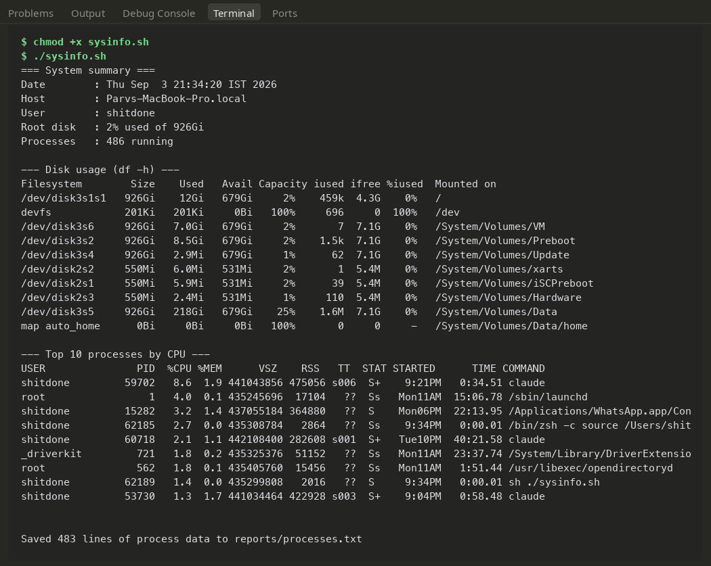
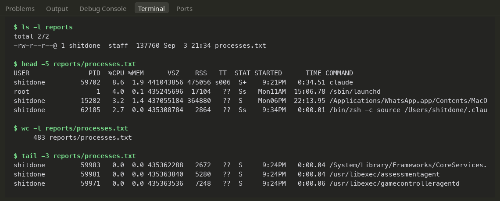

# Shell Scripting — `sysinfo.sh`

A lightweight Bash script that displays a quick system diagnostic summary on-screen, asks the user where to write an audit log, and dumps full process diagnostics to that file using shell output redirection.

---

## Assignment Requirements Breakdown

| Requirement | Implementation in `sysinfo.sh` |
|---|---|
| **System Identity & Date** | Captured via command substitution: `$(date)`, `$(hostname)`, `$(whoami)` |
| **Disk Capacity** | Parsed root filesystem stats using `df -h /` and filtered with `awk` |
| **Process Inspection** | Filtered `ps aux`, sorted descending by CPU utilization, limited to top 10 |
| **Variable Usage** | Tracked in `today`, `box`, `me`, `disk`, `proc_count`, `report_dir`, `report_file` |
| **Interactive User Input** | Captured dynamically with two `read -p` prompts |
| **Directory Creation** | Safely created using `mkdir -p "$report_dir"` |
| **File Initialization** | Created / timestamped with `touch "$report_dir/$report_file"` |
| **Output Redirection** | Redirected complete process list via stdout operator (`>`) |

---

## The Script Source

```bash
#!/bin/bash
# sysinfo.sh - Collects basic machine metrics, prompts for output paths,
# and writes process tables to a custom report file.

today=$(date)
box=$(hostname)
me=$(whoami)
disk=$(df -h / | awk 'NR==2 {print $5 " used of " $2}')
proc_count=$(ps aux | wc -l | tr -d ' ')

echo "=== System summary ==="
echo "Date        : $today"
echo "Host        : $box"
echo "User        : $me"
echo "Root disk   : $disk"
echo "Processes   : $proc_count running"
echo

echo "--- Disk usage (df -h) ---"
df -h
echo

echo "--- Top 10 processes by CPU ---"
ps aux | sort -rk 3 | head -n 10 | cut -c1-110
echo

read -p "Directory to save the report in: " report_dir
read -p "Report file name: " report_file

mkdir -p "$report_dir"
touch "$report_dir/$report_file"

# Redirect the untruncated process list to the chosen report file
ps aux > "$report_dir/$report_file"

echo
echo "Saved $(wc -l < "$report_dir/$report_file" | tr -d ' ') lines of process data to $report_dir/$report_file"
```

### Scripting Implementation Details

- **Safe Variable Quoting:** All variable expansions (e.g. `"$report_dir"`) are wrapped in double quotes to gracefully handle directory or file names containing spaces.
- **Idempotent Directory Creation:** `mkdir -p` ensures the script doesn't blow up if the target directory already exists.
- **CPU Sorting:** `sort -rk 3` sorts descending based on column 3 (`%CPU`) from `ps aux`. On screen, `cut -c1-110` truncates overly long commands to prevent messy line-wrapping, whereas the saved file receives the full, unaltered output.
- **Redirection Semantics:** Single greater-than `>` truncates and overwrites the destination file fresh on each invocation. Switching to `>>` would append instead.

---

## Executing the Script

Make the script executable and trigger the run:

```bash
chmod +x sysinfo.sh
./sysinfo.sh
```

During the interactive run, we passed `reports` as the folder name and `processes.txt` as the output filename.

### Terminal Output: System Summary & Top Processes



### Verifying the Saved Report

Inspecting the output file with `ls`, `head`, and `wc -l` confirms the full process list was cleanly redirected to disk:



*(The generated `reports/` folder is created at runtime and excluded from source control).*
